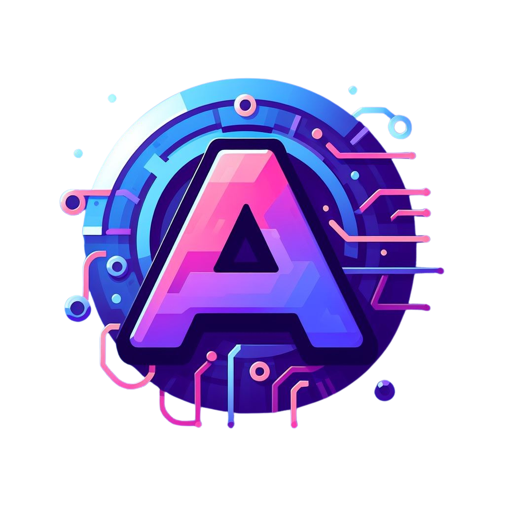

<!-- Improved compatibility of back to top link: See: https://github.com/othneildrew/Best-README-Template/pull/73 -->

<!--
*** Thanks for checking out the Best-README-Template. If you have a suggestion
*** that would make this better, please fork the repo and create a pull request
*** or simply open an issue with the tag "enhancement".
*** Don't forget to give the project a star!
*** Thanks again! Now go create something AMAZING! :D
-->

<!-- PROJECT SHIELDS -->
<!--
*** I'm using markdown "reference style" links for readability.
*** Reference links are enclosed in brackets [ ] instead of parentheses ( ).
*** See the bottom of this document for the declaration of the reference variables
*** for contributors-url, forks-url, etc. This is an optional, concise syntax you may use.
*** https://www.markdownguide.org/basic-syntax/#reference-style-links
-->
[![Contributors][contributors-shield]][contributors-url]
[![Forks][forks-shield]][forks-url]
[![Stargazers][stars-shield]][stars-url]
[![Issues][issues-shield]][issues-url]
[![MIT License][license-shield]][license-url]

<!-- PROJECT LOGO -->
 

  

<h3 align="center">👋AchroDev</h3>

  

    This is my personal repository full of learning and fun projects.
     
  

<!-- USAGE EXAMPLES -->
## Programming Languages

<!-- CONTACT -->
## Contact
Project Link: [https://github.com/AchroDev/AchroDev](https://github.com/AchroDev/AchroDev)

<!-- ACKNOWLEDGMENTS -->
## Acknowledgments

* [othneildrew's README template](https://github.com/othneildrew/Best-README-Template)
* [Badges for programming languages/applications](https://dev.to/envoy_/150-badges-for-github-pnk)

<!-- MARKDOWN LINKS & IMAGES -->
<!-- https://www.markdownguide.org/basic-syntax/#reference-style-links -->
[contributors-shield]: https://img.shields.io/github/contributors/AchroDev/AchroDev.svg?style=for-the-badge
[contributors-url]: https://github.com/AchroDev/AchroDev/graphs/contributors
[forks-shield]: https://img.shields.io/github/forks/AchroDev/AchroDev.svg?style=for-the-badge
[forks-url]: https://github.com/AchroDev/AchroDev/network/members
[stars-shield]: https://img.shields.io/github/stars/AchroDev/AchroDev.svg?style=for-the-badge
[stars-url]: https://github.com/AchroDev/AchroDev/stargazers
[issues-shield]: https://img.shields.io/github/issues/AchroDev/AchroDev.svg?style=for-the-badge
[issues-url]: https://github.com/AchroDev/AchroDev/issues
[license-shield]: https://img.shields.io/github/license/AchroDev/AchroDev.svg?style=for-the-badge
[license-url]: https://github.com/AchroDev/AchroDev/blob/master/LICENSE.txt
